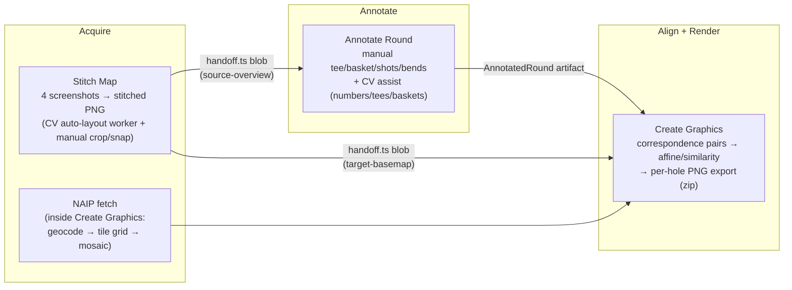
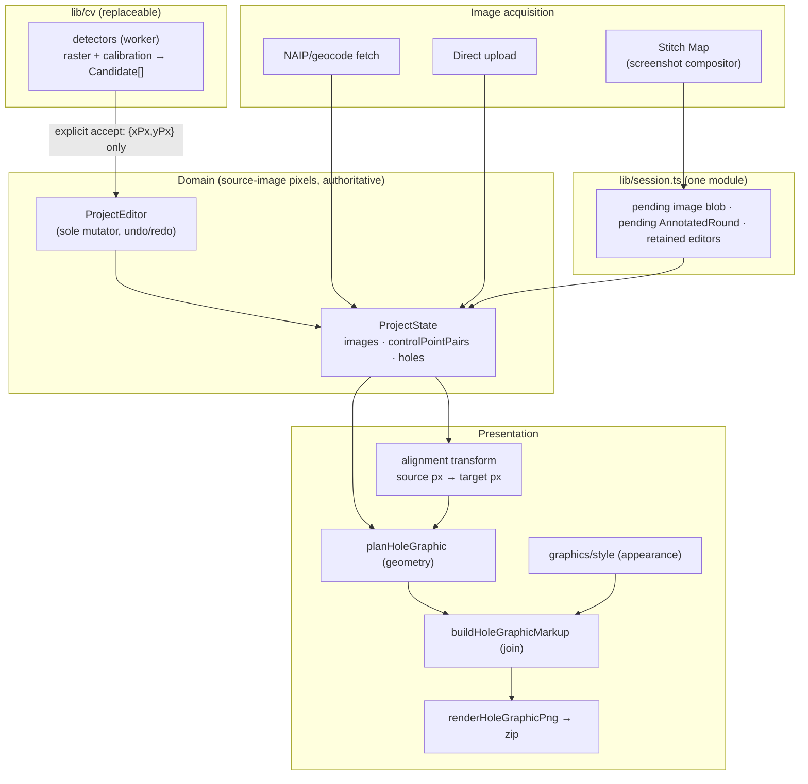

# ChainSpot Architecture Teardown

*Read-only audit, August 2026. Based on the code at `cc7924e` (post check/drag-fix merge), not on planning documents. Three delegated investigations: product/UI workflows, domain/data architecture, CV/rendering/export infrastructure.*

---

## 1. Executive verdict

**Is ChainSpot overcomplicated?** Yes — but in its periphery, not its core. The domain model is already small, disciplined, and close to the minimum the product needs. The complexity lives in four places:

1. **Dead and paused experimental mass.** ~2,500+ lines of CV code that is officially paused or never wired (centerline detection and its golden-comparison tooling, three `_prototype-*` scripts, superseded Python probes), a spike route (`/hole-spike`) kept alive only by its own tests, a duplicate main-thread stitch-import path, an orphaned tee-pad detection branch, and ~25 MB of unreferenced static assets shipped to production.
2. **Three ad-hoc in-memory session modules** (`editorSession`, `annotatedRoundSession`, `stitch/handoff`) that together form a pseudo-domain handoff layer, including a write-only `active` slot built for a workflow that doesn't exist.
3. **Monolithic route files** — `create-graphics` (3,145 lines) is simultaneously a correspondence editor, a project save/open/repair UI, a NAIP aerial-imagery fetcher, and a graphics renderer; `annotate-round` (2,616) and `stitch-map` (1,994) are similar single-file worlds.
4. **Small-scale type fragmentation** — the bare `{xPx, yPx}` point shape is defined four times under different names, `GeoPoint` twice, and every CV detector invents its own raster input type despite `stitch/analysis.ts` having already formalized the shape once.

**What is *not* overcomplicated** — and this matters for the verdict: `ProjectState` is a single authoritative model with one corridor representation (centerline + width; the band is always derived, and the old v2 polygon was already killed with a tested migration). The CV-proposal → authoritative-geometry boundary is genuinely leak-free today. Geometry, style, and rendering are already separated in the graphics path (`planHoleGraphic` / `graphics/style.ts` / `buildHoleGraphicMarkup` / `renderHoleGraphicPng`). The alignment module is coherent and isolated. None of these need redesign.

**How much simplification is available?** Roughly 15–20% of `src/lib` plus most of the prototype scripts can be deleted outright with near-zero risk; three session modules collapse into one; the detector contract collapses to one input/output shape that the code has already converged on independently four times. No new abstractions are required — the target architecture is the current architecture minus its archaeology.

**What to converge toward:** one durable model (`ProjectState`), one mutator (`ProjectEditor`), one handoff artifact (`AnnotatedRound`), one session module, one CV contract (`raster + calibration → scored candidates`, accepted field-by-field into holes), one alignment transform, and one graphics pipeline (geometry plan + style → markup → PNG) that Workstudio later plugs into without any new geometry system.

Six months from now, ChainSpot should look like what it already secretly is: a pretty small application.

---

## 2. Current architecture map

**Product pipeline (three nav-linked routes, connected by in-memory handoff):**



Plus two non-pipeline routes: `/ribbon-editor` ("Ribbon Goldens" — a CV ground-truth authoring tool presented in the product nav) and `/hole-spike` (an unlinked, zero-interactivity rendering spike against a hardcoded fixture).

**Domain (deliberate three-tier split, and it's clean):**

- `domain/project.ts` — `ProjectState` = `{project, images, controlPointPairs, holes, viewState}`. `AnnotatedHole` = `tee? / basket? / shots[] / corridorBends[] / corridorWidthPx / par?`. All coordinates are source-image pixels. JSON-serializable, no transient state (tested: *"contains only durable fields and excludes transient editor state"*).
- `domain/editor.ts` — `ProjectEditor`, the sole mutator, owning undo/redo history and a transient asset-byte registry. No Svelte, no Konva, no UI state. The module docstring explicitly enumerates what it refuses to hold.
- `domain/annotatedRound.ts` — the portable Annotate → Graphics artifact, a narrowed view of `ProjectState` with a documented **provenance rule**: no CV confidence/source flags may ever cross this boundary.

**Persistence:** `.chainspot.zip` = `project.json` (schema v3) + original image bytes. Versioned migrations (v1 no holes; v2's hand-traced corridor polygon deliberately dropped in favor of centerline+width). Serialization re-validates with the same readers used for parsing. `persistence.ts` is a strict ZIP/hash/repair layer that never redefines project shape.

**Coordinate spaces (well-separated):** source-image pixels (authoritative), target-image pixels (via `alignment/*` `SerializableTransform`, applied only in `holeGraphics.ts`), screen/view (via `coords.ts`, inverted at every pointer event), geo lat/lon (fetch-only — never enters `ProjectState`), and stitch-tile space (pre-project; resolves to a flat PNG before anything downstream sees it).

**CV:** OpenCV WASM loaded in three isolated contexts (Node CLIs, browser main thread for stitch Snap, and two independent workers — stitch auto-layout and basket/course detection — each ~15 MB, loaded twice in a session that touches both). Wired production CV: hole-number badges, tee pads (fused path), basket template matching, and `courseGrammar`'s Hungarian assignment, behind a calibration adapter layer. Unwired CV: the entire centerline-detection stack, officially "paused, not pursued further."

**Rendering — four implementations plus a loupe:** Konva scene (`scene.ts`, used by `ImagePane`), a *second* inline Konva scene graph hand-built inside `stitch-map`, DOM ``+SVG overlays (annotate-round, ribbon-editor), offscreen-canvas native-resolution PNG export (`stitch/render.ts`), and the SVG-markup→rasterize graphics path (`holeGraphics.ts`). `magnifier.ts` is a fifth small canvas painter.

---

## 3. Keep / Merge / Delete / Defer

| Concept / module | Verdict | Reasoning | Destination (if merged) | Risk if removed/changed |
|---|---|---|---|---|
| `ProjectState` + `AnnotatedHole` (centerline+width) | **KEEP** | The single authoritative model; corridor duplication already resolved at v3 | — | — |
| `ProjectEditor` (mutation + undo/redo + asset registry) | **KEEP** | Clean, tested, correctly refuses UI state | — | — |
| `AnnotatedRound` artifact + provenance rule | **KEEP** | Correct portable boundary between annotation and presentation | — | — |
| `projectSchema.ts` v3 + `persistence.ts` (`.chainspot.zip`) | **KEEP** | Versioned, self-validating, repair flow works | — | — |
| `alignment/*` | **KEEP** | Coherent, isolated, single transform authority | — | Rename its private `PointCoordinates` (name-collides with domain's) |
| `corridor.ts` (derive band/centerline) | **KEEP** | The one shared geometry derivation; consumed by annotation and rendering | — | — |
| `holeGraphics.ts` + `graphics/style.ts` + `graphics/distances.ts` | **KEEP** | Already the plan/style/markup/render separation Workstudio needs | — | — |
| `coords.ts`, `viewport.svelte.ts`, `ImageViewport` | **KEEP** | The genuinely shared view primitives under every route | — | — |
| Stitch Map route + `stitch/*` pipeline | **KEEP** | Real feeder workflow, only route feeding two downstreams | — | — |
| Annotate Round route | **KEEP** | The core annotation surface | — | — |
| Create Graphics route | **KEEP** | Terminal stage; but recognize it as two modes (Align, Graphics) — see §6 | — | — |
| NAIP/geocode acquisition (`naip*`, `geocode`) | **KEEP** | Functioning production basemap source, not an experiment | — | — |
| Wired CV (numbers/tees/baskets/grammar/calibration/worker) | **KEEP** | Production detection with real accept flow | — | — |
| `cvScaleCompileGuards.ts` | **KEEP** | Zero-runtime compile-time guard; cheap insurance | — | — |
| `cvRuntime.ts` / `cvRuntimeBrowser.ts` | **KEEP** (relocate) | Load-bearing interop shims; but they live in `stitch/` while serving all CV | `lib/cv/` | None — pure move |
| `editorSession` + `annotatedRoundSession` + `stitch/handoff` | **MERGE** | Three vocabularies (`retained`/`pending`/`active`) for one job: carry state across a route change | one `lib/session.ts` | Low — mechanical consolidation |
| Duplicated handoff-import banner logic (both routes) | **MERGE** | Self-documented copy-paste (`annotate-round` comment admits it) | shared helper | Low |
| Per-detector raster + candidate types | **MERGE** | Four detectors independently converged on `{xPx,yPx,widthPx?,heightPx?,score}`; `courseGrammar`'s `CoursePointCandidate` already papers over the mismatch | one `Candidate` + `AnalysisRaster`-style input | Low — shapes already match structurally |
| 4× `{xPx,yPx}` types, 2× `GeoPoint` | **MERGE** | Same shape, no shared base; space tracked only by naming discipline | one canonical point type (+ keep `TargetPoint` as the space-tagged exception) | Low — structural typing means no runtime change |
| `annotatedRoundSession.active` slot | ~~DELETE~~ **KEEP** *(corrected)* | Was write-only when audited; PR #11 (Course Memory) now reads it in create-graphics to restore an in-session round | lives on in `session.ts` | — |
| `/hole-spike` route + fixture zip + 2 dedicated specs | **DELETE** | Unlinked, zero-input spike; its SVG-overlay rendering superseded by `holeGraphics.ts` | — | None — tests exist only to keep the spike green |
| `centerlineDetection.ts` + `centerlineGolden.ts` + `detect:centerlines` | **DELETE** (from `src/lib`) | Officially paused ("never wired into production — worker, UI, nothing"); production uses manual `corridorBends` | park remnants under `scripts/cv-probes/` if a record is wanted | Low — re-add from git if the experiment resumes |
| `teePadDetection.ts::detectOccludedEdgeLoopCandidates` | ~~DELETE~~ **KEEP** *(corrected)* | The audit's "orphaned" claim was wrong: `cvCalibratedDetectors.detectCalibratedTeeGapFallbackCandidates` calls it from the production worker as the low-confidence tee gap fallback (commit `c5b5d63`) | — | Deleting it would regress live detection |
| `smartImport.ts::smartImportFiles` (main-thread path) | **DELETE** | Route uses only the worker path; this is a parallel orchestration kept as a test convenience | tests exercise the shared pure stages (`autoCrop`/`autoLayout`) directly | Medium-low — requires test rewiring first |
| `scripts/_prototype-*.ts` (3 files) | **DELETE** | Self-labeled failed experiments; conclusions recorded in `cv-probes/README.md` | — | None |
| Python probes v2/v3 (`static_course_centerline*.py`) | **DELETE** (after verification) | Superseded by v4; retained only because `ribbon_centerline_experiments.py` imports them | — | Low — unpin the import first |
| `static/resources/clean-tiles/` (~25 MB), 2 template zips, duplicate `IMG_5641.jpg` | **DELETE** | Zero references repo-wide; clean-tiles ship to GitHub Pages for nothing | — | None |
| Root `+page.svelte` stub | **DELETE** | Unreachable (load always redirects) | — | None |
| Ribbon editor + `ribbonGolden.ts` | **DEFER** (relocate) | Legitimate CV ground-truth authoring tool, but presented in product nav as a peer of real workflows | move out of main nav (dev/tools entry) | Low — keep the functionality; CV work still uses it |
| `ImageEditorPane` vs `ImagePane` shell duplication | **DEFER** | Partial overlap (intake, claim wiring, discard) but real divergence; extraction is churn with little product payoff | — | Refactoring risk exceeds benefit today |
| Per-hole presentation/style persistence (schema v5) | **DEFER** | This is Workstudio's one new concept; don't build it early | — | — |
| Double OpenCV WASM load (2 workers) | **DEFER** | Real, documented cost; optimizing is orthogonal to architecture | — | — |

---

## 4. Target architecture

The smallest architecture is the current one with the archaeology removed and three seams named. No new layers, no new patterns.



**Canonical objects that survive:** `ProjectState` / `AnnotatedHole` / `ImageAsset` (domain), `ProjectEditor` (mutation), `AnnotatedRound` (handoff artifact), `SerializableTransform` (alignment), `Candidate` (CV proposal), `HoleGraphicPlan` + style preset (presentation), `.chainspot.zip` (persistence).

**Concepts that disappear:** the hole-spike rendering path, the centerline detection stack, the main-thread smart-import twin, the `active` round slot, two of the three session modules, three of the four+ point types, per-detector raster types.

---

## 5. Canonical data ownership

| Data | Owner | Notes |
|---|---|---|
| Tee / basket / corridor (bends+width) / throws / par | `AnnotatedHole` inside `ProjectState.holes` — mutated only via `ProjectEditor` + `holeAnnotation.ts` reducers | Corridor band and centerline polyline are always **derived** (`corridor.ts`); never stored |
| CV proposals | Detector `Candidate` types, worker-side only | Never persisted; enter the domain solely through explicit `{xPx, yPx}` extraction at user-driven accept. Recommendation: formalize as `acceptCandidate(c): SourcePoint` adapters so a careless `{...candidate}` spread can never carry `score` onto a hole |
| Image / source metadata | `ImageAsset` (id, role, dims, sha256, bundlePath) in `ProjectState`; `AnnotatedSourceImage` as the deliberately narrowed handoff copy | The narrowing is documented and one-directional — keep both |
| Visual style | `graphics/style.ts` presets (today); a persisted per-hole/course `PresentationStyle` block in schema v5 (when Workstudio lands; v4 was claimed by Course Memory's badge anchors, #11) | The only planned new authoritative object in the system |
| Transient editor state | Route-local Svelte `$state` + `correspondenceState.ts` (pending half-pair) + `ViewportController` | Correctly barred from `ProjectState` (documented and tested); keep it that way |
| Cross-route transit | One `lib/session.ts`: pending stitched blob, pending `AnnotatedRound`, retained editors | In-memory only, cleared on reload — acceptable for a local-first SPA |
| Persisted | `.chainspot.zip` = schema v3 JSON + original image bytes | Pixels win over normalized values on load |
| Exported | Stitched PNG (native res, 16384px canvas guard); per-hole PNGs at native target-crop resolution, zipped | No resampling anywhere — preserve this |

---

## 6. UI / workflow simplification

**Remain (the product is these three):**
- **Stitch Map** — feeder stage. Unchanged.
- **Annotate Round** — annotation + CV-assist stage. Unchanged.
- **Create Graphics** — but recognize what it actually is: **two modes wearing one route**. Mode A is *Align* (choose/fetch the target basemap, place correspondence pairs, estimate the transform). Mode B is *Graphics* (plan + style + export per-hole PNGs). No route split is required today, but the internal state boundary between the modes should be made explicit (see migration step 5), because Mode B is exactly where Workstudio docks — Workstudio replaces/extends the Graphics mode, not the page.

**Become a dev tool (out of the product nav):**
- **Ribbon Goldens** — it's a CV ground-truth authoring tool with dev-audience naming, zero connection to the product pipeline, and page-local state. Keep it; stop presenting it as a peer of the three real workflows.

**Disappear:**
- **`/hole-spike`** — plus its fixture and its two dedicated specs, which validate unreachable surface.
- Root `+page.svelte` stub (the redirect in `+page.ts` does the work).

**Merge:**
- The two copy-pasted "import stitched image" banner flows into one shared helper (data logic at minimum; markup can stay per-route for the discard-dialog difference).
- The three session modules into one.

---

## 7. CV simplification

**Where CV belongs:** one `lib/cv/` area (runtime loader + detectors + calibration + worker), with `stitch/` as a *consumer* of the runtime rather than its owner. Today `cvRuntime.ts` lives in `stitch/` and `basketDetection.worker.ts` imports `loadCv` from `stitch/cvMatch.ts` — an accidental dependency of the annotation domain on the stitching domain. Moving the runtime is a pure relocation.

**The minimum boundary (already latent in the code):** all four production detectors independently converged on

```
(raster: {widthPx, heightPx, gray, rgba?, sourceScale}, options) → Candidate[]
Candidate = {xPx, yPx, widthPx?, heightPx?, score}
```

`stitch/analysis.ts` formalized the raster shape once; the detectors each reinvented it. `courseGrammar.ts`'s `CoursePointCandidate` (with its self-described "compatibility field" for `score` vs `confidence`) is the existing evidence that a single candidate type is wanted. Adopt these two types and stop — **no interface hierarchy, no pipeline framework, no plugin registry.** A detector is a function of this shape; replacing OpenCV with a learned model changes the function body, nothing downstream.

**How results enter the canonical model:** exactly as they do today — user-driven accept that extracts `{xPx, yPx}` and discards everything else — but hardened from convention to code with per-detector `acceptCandidate()` adapters, so wiring future detectors (tee pads, or a resumed centerline effort) can't accidentally spread CV fields onto `AnnotatedHole`. The `AnnotatedRound` provenance rule stays as the backstop.

**What leaves:** the paused centerline stack out of `src/lib` (it is the single largest block of unwired code in the product tree); the orphaned occluded-edge-loop branch; the `_prototype-*` scripts; the superseded Python probes. The CLI scripts for *active* detectors (`detect:tees`, `detect:baskets`, `detect:course`, `verify:cv`) stay — they're the regression harness for the wired pipeline.

**Coupling to remove:** just the `stitch/` ownership of the runtime, and the shared-type unification above. The worker boundary itself is already right.

---

## 8. Rendering + the Workstudio seam

The separation Workstudio needs **already exists** in the graphics path — this is the audit's most convenient finding:

- **WHAT happened / where the hole is:** `AnnotatedHole` + `SerializableTransform` → `planHoleGraphic()` (pure: computes target-space geometry and crop).
- **HOW it looks:** `graphics/style.ts` (pure palette/appearance presets, zero geometry or UI coupling) + `graphics/distances.ts`.
- **Combine:** `buildHoleGraphicMarkup(plan, style, feetPerPixel)` — the single join point, emitting SVG markup.
- **Export:** `renderHoleGraphicPng()` — rasterize at native crop resolution; `zipHoleGraphics()`.

**The seam, stated minimally:** Workstudio is an editor over a new persisted `PresentationStyle` object (style preset selection + per-element overrides for corridor appearance, tee/basket markers, throw paths, labels + framing/crop parameters + graphic presets), whose output feeds `buildHoleGraphicMarkup` unchanged and whose live preview is the same markup rendered in the DOM instead of rasterized. It edits presentation state only; it never mutates `AnnotatedHole`. Framing/crop moves from a hardcoded computation inside `planHoleGraphic` to a style-supplied input with the current behavior as default — that is the one function-signature change the seam requires.

What must *not* happen: a second geometry system, a second renderer, or style state stored on holes. The four existing rendering implementations stay as they are (see §11) — Workstudio touches only the `holeGraphics` path.

---

## 9. Deletion / consolidation opportunities

**Obviously dead / superseded (delete with confidence):**
- `src/routes/hole-spike/` + `static/resources/hole-spike/one-hole.chainspot.zip` + `tests/e2e/holeSpike.spec.ts` + `tests/unit/holeSpike.test.ts`
- `src/lib/autoAnnotation/centerlineDetection.ts`, `centerlineGolden.ts`, the `detect:centerlines` npm script (paused per `scripts/cv-probes/README.md`; zero `src` imports)
- `scripts/_prototype-band-fragments.ts`, `_prototype-band-hough.ts`, `_prototype-canny-check.ts`
- `static/resources/clean-tiles/` (~25 MB shipped for nothing), `static/resources/chainspot_cv_templates.zip`, `chainspot_cv_templates_fixed.zip`, duplicate `resources/IMG_5641.jpg`
- `annotatedRoundSession.ts` `active`/`getActiveAnnotatedRound`/`setActiveAnnotatedRound`
- Root `src/routes/+page.svelte` stub

**Likely removable after verification:**
- `smartImport.ts::smartImportFiles` (rewire its two unit-test consumers to the shared pure stages first)
- ~~`teePadDetection.ts::detectOccludedEdgeLoopCandidates`~~ *(correction: production code — the worker's gap-recovery fallback calls it via `cvCalibratedDetectors`; keep)*
- `scripts/cv-probes/static_course_centerline.py`, `static_course_centerline_semantic.py` (unpin `ribbon_centerline_experiments.py`'s imports first)
- Ad-hoc scripts `gate-real-crop.mjs`, `perf-smart-import.mjs`, `probe-cv-match.mjs`, `real-capture-ground-truth.mjs`, `inspect-auto-layout-scoring.mjs` (self-labeled throwaway; keep any the team still runs)
- `resources/centerline-golden.json` *(deleted)*; `resources/ribbon-reference/*` *(correction: kept — `verify-cv-guardrails.ts` reads two of its files for the numbers guardrail)*

**Still necessary (don't touch despite appearances):**
- `cvScaleCompileGuards.ts` (compile-time-only by design), `cvRuntime.ts`/`cvRuntimeBrowser.ts` (interop shims for real bundler bugs), `static/resources/chainspot_cv_templates/` unzipped dir (fetched at runtime by the worker), `resources/GoldenTeeSet` / `GoldenBasketSet` zips and `resources/real-capture/` (regression fixtures for wired CV), the fixture-generator scripts (`generate-*.mjs`), ribbon-editor + `ribbonGolden.ts` (relocate, don't delete).

---

## 10. Migration sequence

Five bounded tickets; the app is fully usable after each.

1. **Delete dead surface.** Everything in §9's "obviously dead" list, plus the `detect:centerlines` script entry. Pure deletions; run `npm run check` + unit + e2e to confirm nothing referenced them.
2. **Consolidate session handoff.** One `lib/session.ts` (retained editors, pending stitched blob, pending `AnnotatedRound`); extract the shared handoff-import helper used by both banners. Delete `editorSession.ts`, `annotatedRoundSession.ts`, `stitch/handoff.ts`.
3. **Tidy the CV boundary.** Move `cvRuntime`/`cvRuntimeBrowser` (and `loadCv` access) to `lib/cv/`; adopt the single `Candidate` + shared raster type across the four detectors and `courseGrammar`; add `acceptCandidate()` adapters at the annotate-round apply sites; delete `detectOccludedEdgeLoopCandidates` and (after test rewiring) `smartImportFiles`.
4. **Canonicalize point types.** One `{xPx,yPx}` type (keep `TargetPoint` as the space-tagged name for post-transform space; rename `alignment`'s `PointCoordinates`); merge the two `GeoPoint`s. Mechanical, driven by `npm run check`.
5. **Name the Graphics seam.** Inside create-graphics, isolate the graphics-mode state (plan inputs, style selection, export) behind a module boundary, and promote framing/crop to an explicit input of `planHoleGraphic` with today's behavior as default. No visual change, no new route. This is the only forward-looking step, and it is the entire Workstudio prerequisite.

Then build Workstudio (new product functionality, schema v5 `PresentationStyle`; v4 was claimed by Course Memory, #11) — outside this sequence.

---

## 11. What NOT to refactor

- **`cvRuntime.ts` / `cvRuntimeBrowser.ts` internals.** Sixty lines of comments about three bundler interop bugs is ugly and load-bearing. Relocate the files (step 3); do not "clean up" their contents.
- **The four rendering implementations.** Konva for interactive correspondence panes, inline Konva for stitch tiles, ``+SVG for annotation overlays, offscreen canvas for exports — each fits its context. A unified rendering engine is exactly the kind of abstraction this audit exists to prevent. (The recent crop-handle drag bug lived in the *arbitration between* input systems, not in having multiple renderers — and it's now explicitly documented at the seam in `ImageViewport`.)
- **The three monolithic route files as files.** `create-graphics` needs its *state* seam named (step 5); it does not need to be decomposed into components for aesthetics. It carries 13 of 20 e2e specs — churn there is risk without product payoff. Same for `stitch-map`'s 1,994 lines and its bespoke Konva scene.
- **`ImageEditorPane` vs `ImagePane` shell overlap.** Real but divergent; extraction is a refactor in search of a payoff. Share the handoff-import helper (step 2) and stop.
- **The triple re-validation of `AnnotatedHole` bounds** (editor, schema, artifact). Deliberate never-trust-the-previous-layer redundancy, each with tests. Leave it.
- **`projectSchema.ts`'s explicit field-by-field serialization.** Verbose by design so unknown fields can't survive a round trip.
- **Detector algorithm internals** (`teePadDetection`, `holeNumberDetection`, `basketTemplateDetection`). Proven against golden fixtures; restyle nothing.
- **The double WASM load.** Known, documented, and an optimization problem — not an architecture problem.

---

## 12. Final architecture test

*If we implemented this simplification and wanted to build Workstudio next week, what new architectural concept would it require?*

**One: a persisted `PresentationStyle` object** (style preset + per-element appearance overrides + framing) added as schema v5 (v4 = Course Memory badge anchors, #11), edited by Workstudio, consumed by the existing `buildHoleGraphicMarkup`. Everything else Workstudio needs already exists after the migration: the geometry it reads is `AnnotatedHole` + transform (untouched), the renderer it drives is the existing markup pipeline (live preview = same SVG in the DOM), the export is the existing rasterizer, and the route slot is create-graphics' named Graphics mode. No new geometry system, no new renderer, no new session machinery.

That is as close to "almost none" as a real codebase gets.

---

## Appendix: preserved-principles check

Every invariant the brief asked to preserve was verified present in code, none needs weakening: source-image pixels are authoritative ("pixels win" on load, tested); the CV/authoritative split is real and currently leak-free (harden per §7); manual correction is the primary path (CV is assist-only); local-first/static deployment holds (the only network calls are NAIP/USGS and Nominatim basemap acquisition — by design, not a violation); single-hole and full-course both work (`beyond 18` included); style-vs-geometry reuse already exists via presets; exports are native-resolution with no resampling; geometry (`corridor.ts`, `alignment/*`, `holeGraphics` planning) is pure and tested independently of UI.

---

## Post-implementation addendum (2026-08-10)

The five-ticket migration was implemented on this branch (commits `b8323db`, `2bf6569`, `2f1ffcd`, `1f8f522`, `cb14eeb`), after PR #11 "Course Memory" merged (schema v3→v4, IndexedDB course library, a fourth session module — all reconciled into the tickets). Full suites green throughout: `npm run check`, unit, e2e, and both build configurations.

Corrections to this document discovered during implementation (marked *(corrected)* inline above):

1. **`detectOccludedEdgeLoopCandidates` is production code, not orphaned.** The gap-recovery fallback in `cvCalibratedDetectors.ts` calls it from the basket-detection worker (wired by `c5b5d63`, an ancestor of this audit's baseline). Kept.
2. **`annotatedRoundSession.active` is no longer write-only.** Course Memory's recognition flow reads it in create-graphics. Kept (now in `session.ts`).
3. **`resources/ribbon-reference/` is not centerline-only.** `verify-cv-guardrails.ts` reads two of its files for the numbers guardrail. Kept.
4. **`smartImportFiles` deletion deferred by its own precondition.** Its atomicity tests depend on injectable decode hooks the worker path doesn't expose; rewiring them would have meant duplicating orchestration logic in tests, the exact outcome the ticket forbade. Kept.
5. **Schema numbering shifted:** v4 = Course Memory badge anchors; the future Workstudio `PresentationStyle` becomes v5 (updated inline).
