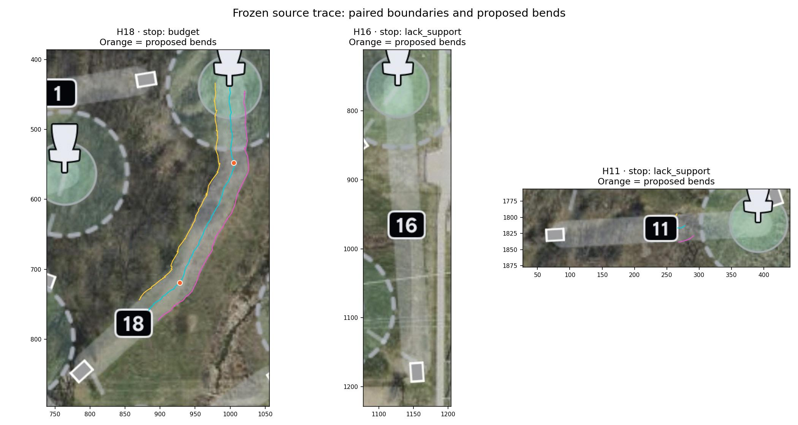

# Paired-boundary follower: frozen broad-run checkpoint

This is an experimental candidate producer, not a promoted course-path detector.
The uniform 90-pose cap is a known design defect for long holes. Its receipt
means a censored prefix; resumable compute slices and evidence-driven stopping
are proposed in the LAB matrix note and are not implemented here.
Source manifest: `bend-follower/SOURCE-FREEZE.json`, aggregate
`83024da1ee065de5f778ac2a922350f218bc3799c080a177870a5e0ad6bfc2c3`.
All 18 DashsTrack seeds ran against the same immutable source copy, with 90
maximum poses and no supplied Basket target or bend coordinates/count.
Trace: `99b389c8283b494617d8c55d468e9fa8ff0fdc3c9a0b80080e3434a41d33b078`.

## Replay

From this checkpoint's root, run `python3 prepare.py`, then
`bash bend-follower/exp/paired-boundary-follower/run.sh`.
The selected experiment explicitly enables its feature. Its archived ABFeature
gateway also exercises the OFF ablation: OFF executes zero operations, ON one,
with exact declared/actual board slots. This standalone adapter is not yet a
registered LAB Sweep matrix arm. The proposed LAB integration is documented in
`LAB-BROAD-TESTING-PROPOSAL.md`.

Run `bash bend-follower/check.sh` for dependency-light checks. They verify
subpixel sampling, straight/piecewise math, signed multiscale disagreement,
rendering, blank-source stopping, and a crossing distractor. The synthetic
turning-corridor run is a retained FAILURE WITNESS: it stops before resolving
the bend. Executing that fixture is not a successful turning-detection test.

## What the broad run says

| Outcome | Holes | Meaning |
|---|---|---|
| No advance | 2, 4, 5, 16, 7, 15, 10 | Seed pose retained, no supported next step |
| Advanced then stopped | 1, 3, 6, 8, 13, 11 | Lost support before budget |
| Budget reached | 18, 17, 9, 14, 12 | Not proof of route or endpoint correctness |

H18's source-calibrated initial width is 40px. Its two proposed bends are 18.90px
and 17.64px from the saved annotations under an independent one-to-one match.
The annotation enters `review-bend-trace.py` only after the trace is frozen.
H18 reaches the Basket-circle neighborhood. C2 ownership/arrival is not adjudicated.
The latest H11 and H16 controls stop early; H16 calibration chooses the 100px
search bound. Several longer traces follow neighboring structures. This does
not establish broad pathfinding success.

## Model and remaining gaps

The discrete beam retains position, heading, width and parent states, scores
both inward-facing edges, and penalizes heading change. Narrow/broad scale
polarity disagreement is UNKNOWN. Bend candidates use piecewise perpendicular
SSE in source px² with a declared complexity penalty. The candidate budget is
three. This is an approximate bounded search, not globally optimal fast marching.
Its foundational model family is curvature-aware path search, e.g.
https://www.ipol.im/pub/art/2019/227/ .

Known Badge bounding boxes exclude support and make transit explicit. Width
calibration still chooses a strongest local pair and can lock onto other
structures; it does not yet aggregate a family across the exposed leg. Center
appearance, reliable ring ownership, walkback recovery, and C2 stopping remain
unimplemented. Auxiliary beam alternatives retain terminal summaries; H18
named ablations retain full point geometry. Only H18 has all named ablations
in this checkpoint. Three Tee seeds (H3/H5/H12) are explicitly annotation-assisted.

Pre-fix H18 Badge-border failure and the earlier longer permissive trace are
saved in `bend-follower/review/history/`. They came from earlier revisions and
are not mixed into the frozen 18-hole comparison. Source scripts, receipts and
review images are preserved here so this result can be revisited.
