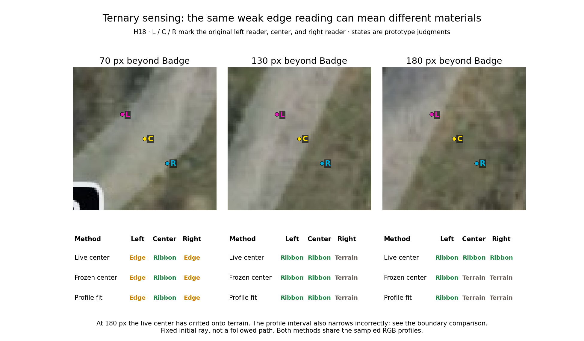
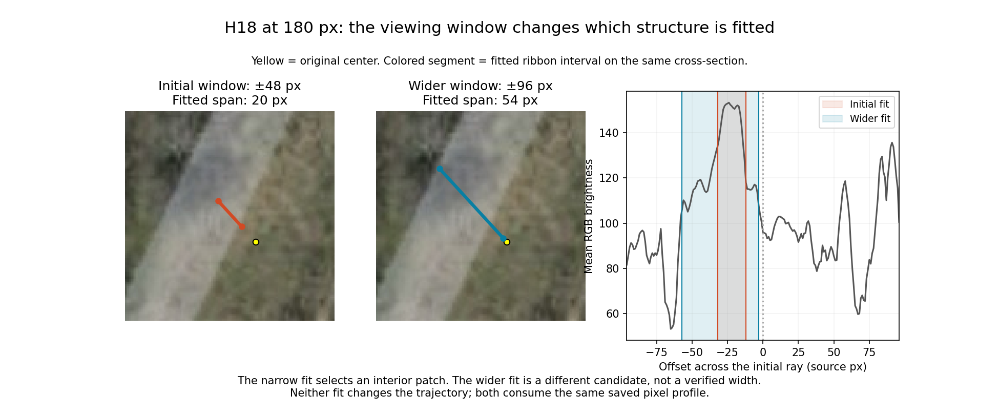
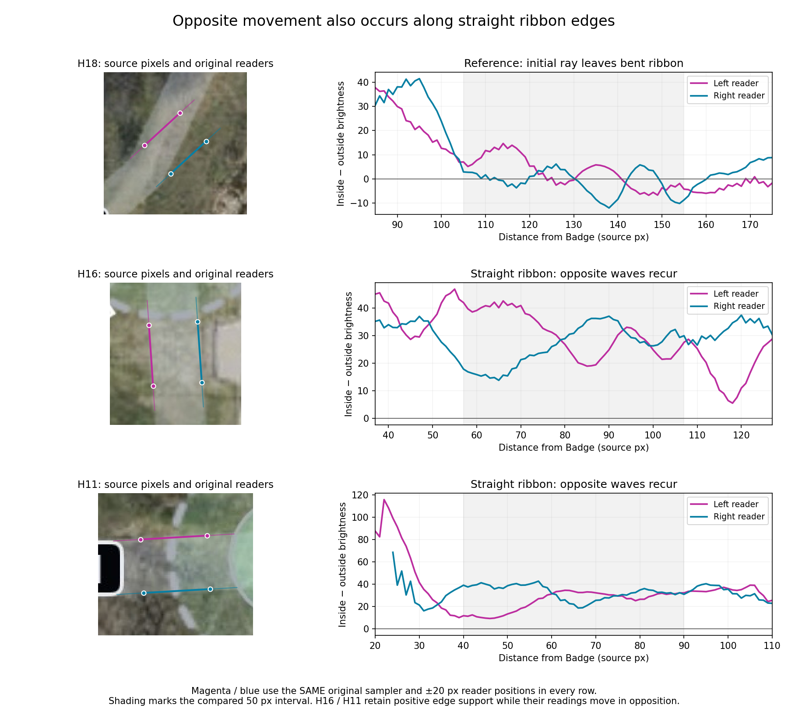
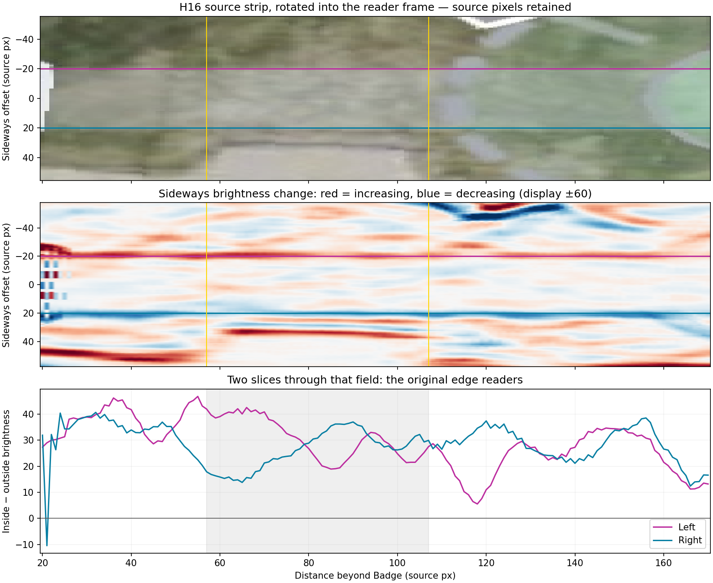

# DashsTrack edge-sensing checkpoint

This preserves the recovered original curve sampler, the tested ternary sensing
prototype, its review images and receipts, and the straight-hole scan in progress.
It is an additive experiment checkpoint. It does not modify clean stages or claim
to have fixed pathfinding. Selecting each exp entry runs its behavior.

## Run

Requires Node 24, Python 3, Pillow, NumPy, Matplotlib, SciPy. From this directory:

```sh
python3 prepare.py
node restored/edge-diagnostic/edge-readings-work/exp/edge-support-readings/run.mjs
python3 restored/edge-diagnostic/edge-reading-inspection/render.py
bash ternary-edge/exp/ternary-edge/run.sh
node straight-edge-pattern/exp/straight-edge-pattern/sample.mjs
```

The ternary run recreates the full trace under `ternary-edge/output/gateway`.
For the separate review scripts, copy that trace to
`ternary-edge/output/all18/trace.json`. The shipped images came from the same
trace hash recorded in the gateway receipt. All original source pixels are
recreated from the committed SHA-checked JPEG by `prepare.py`.

## Visible findings



At H18 d130, a weak old edge response becomes left RIBBON / right TERRAIN.
At d180, the live middle reference is itself terrain and produces wrong labels.
Frozen-reference and profile-fit comparisons expose that failure. This is a
fixed initial ray, not a followed route. H16 still has unresolved edge readings.



The initial profile fit selects a 20 px interior patch. The wider-window
comparison finds a 54 px candidate; neither is verified physical corridor width.

Seven sensing unit tests and three renderer checks passed before checkpoint.
The production ABFeature gateway executed the producer with exact slot custody;
its 0-operation OFF and 1-operation ON receipts are preserved. The archived gateway runtime is vendored as `runtime.tar.gz` for reproducibility.

The straight-hole scan now has source-reviewed recurrences: H16 at 57–107 px
and H11 at 40–90 px beyond Badge. Opposing waves occur while both original edge
readers retain positive support. Cause remains unresolved. Run
`bash straight-edge-pattern/exp/straight-edge-pattern/run.sh` after `prepare.py`.
The two-dimensional H16 field keeps source pixels, sideways position and distance
aligned. All nine straight-hole curves, ranking outputs and 5,719 exact original
sampler comparisons are saved with the script.





See `ternary-review/RESULTS.md` for detailed provenance and limitations.

## Working rule

Preserve scripts and recognizable results in Git at each useful checkpoint.
Keep experiments enabled when selected. Do not overwrite clean implementations.
Do not turn same-pixel model agreement into independent confidence.
