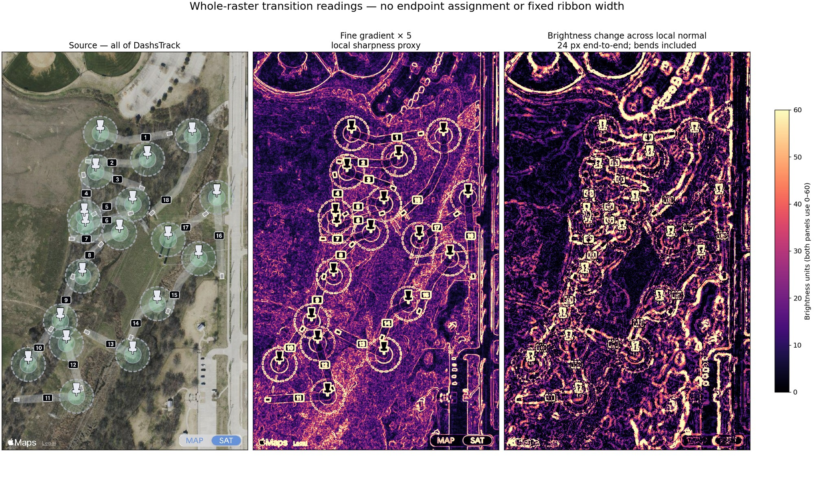
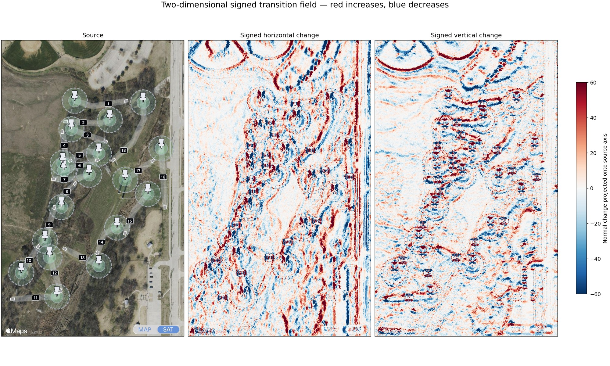

# DashsTrack: whole-raster transition readings

Selected experiment:

```bash
./exp/transition-field/run.sh
```

Run from this directory, or execute the entry by its full relative path. The default source is the sibling `../restored/edge-diagnostic/edge-reading-inspection/DashsTrack-full.jpg`. Override with `--source path/to/image`. Python dependencies: NumPy, SciPy, Pillow, Matplotlib. `python3 -m unittest test_measure.py` runs four numerical checks. `--render-only` reuses the saved NPZ.

## What the pictures mean

- `DashsTrack-transition-comparison`: source, fine sharpness proxy, and total change across a wider normal profile, all of DashsTrack. The latter two have the same 0–60 display range. `gradient × 5` approximates a locally linear five-pixel difference; it is not an exact replay of the historical sampler.
- `DashsTrack-signed-transition-fields`: change projected onto each original source axis. Two signed views preserve increasing/decreasing sides without assigning an inside to any ribbon.
- H18/H16/H11 detail: source, fine gradient, normal change, and conditional local transition-span estimate.
- `DashsTrack-transition-overlay`: continuous cyan overlay weighted by positive total change, local monotonicity and orientation coherence. This is a display projection, not probability or pixel ownership.

Every PNG has a smaller JPEG counterpart for Git and fast inspection. Source and fields also exist as separate full-resolution images for toggling. All axes retain the original source frame: no endpoint-based rotation, course masking or bend annotations enter the calculation. Named crops are viewing rectangles only.

## Computation and retained material

Brightness is arithmetic RGB mean. The entire 1290×2091 source is sampled on a 2px grid (674,670 positions). Gaussian derivative fields at sigma 1, 2 and 4 source pixels are saved. The sigma2 gradient establishes each local profile normal. The normal points toward increasing local brightness; it can be influenced by terrain, glyphs, circles and overlapping edges.

At each position the script retains 25 raw brightness samples, at one-pixel offsets −12…+12 along that normal, plus a profile sampled from a sigma1-smoothed source. Finite differences of the smoothed profile yield:

- signed end-to-end brightness change;
- positive and negative change mass separately;
- 10th, 50th and 90th percentile positions of positive derivative mass;
- their 10–90% span;
- monotonicity, `(positive−negative)/(positive+negative)`;
- out-of-bounds and active-window-boundary flags;
- local orientation coherence from a sigma4 structure tensor.

The span display is conditional: monotonicity≥0.8, positive mass≥5 brightness units, a valid normal, an in-bounds profile, and no active window boundary. Boundary activity means the mean positive derivative in the first/last two intervals exceeds 25% of its profile peak. These are prototype interpretation parameters; raw values remain available. Span values and validity are displayed with nearest-neighbor resampling so invalid neighbors do not manufacture widths.

**This is positive-gradient-mass span, not ribbon width, alpha, anti-aliasing width, or a Gaussian scale selection.** Multiple same-direction transitions may still contribute to one span. Raw profiles preserve that ambiguity. The 50% offset is a local transition-location estimate saved in NPZ; no geometric edge chain is fitted or rendered from it.

## What this run supports

The whole field exposes curved as well as straight structures. The H18 fine-gradient image already visibly traces both bends. The wider profile makes some broader changes conspicuous, but also broadens terrain/glyph/circle responses and loses localization. The conditional span view leaves many locations unresolved. The image does not establish that broad transitions uniquely identify ribbons or that pathfinding is solved.

No Tee/Badge/Basket seeds, hole assignments, nominal ribbon width, annotation paths, or target endpoints are used in these calculations. This is a standalone selected experimental renderer, not a new ABFeature gateway operation and not a clean-stage change.

`output/transition-fields.npz` retains raw profiles and measurement arrays for reuse; regenerate instead of committing its ~140MB contents. `output/receipt.json` records source hash and all observation parameters. Tests show identical-contrast blurred steps have wider measured spans, a uniform image remains unresolved, a ramp remains unresolved because its transition reaches the window boundary, and sampled coordinates reproduce a known image exactly. They do not establish real-course detection accuracy.

## Full-course materializations




