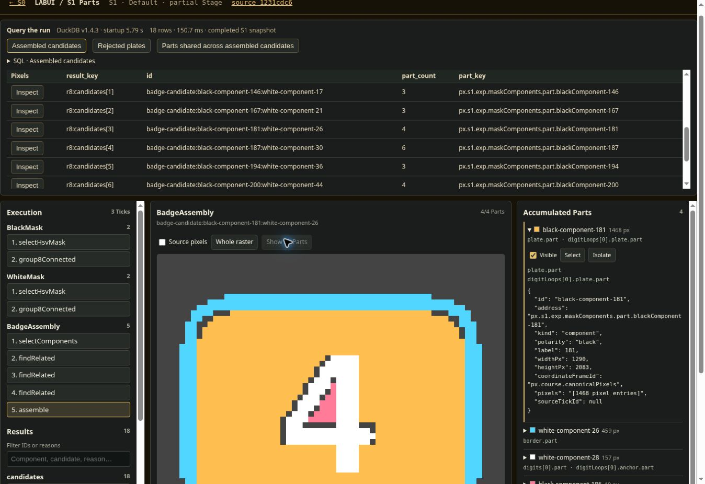

# DuckDB over a completed PQL run

**Implemented and executed at `1231cdc69420c69c47b4708e877a631155bab162`, on `lab/parts-inspector`.** The existing S1 YAML runs through the existing executor; DuckDB then queries its recorded results. A query row opens the original Parts in the interactive pixel inspector. This is a working browser integration, with a successful static staging build. It has not been deployed to GitHub Pages.



## What ran

The tracked DashsTrack-full.jpg passed through the existing S0 crop, producing a 1290 × 2083 raster. S1 ran three Ticks containing nine Calculations: BlackMask, WhiteMask, and BadgeAssembly. The existing thresholds, pixel selection, component grouping, and assembly Calculations were unchanged.

| Recorded result | Count |
|---|---:|
| Black components | 952 |
| White components | 176 |
| Selected plates | 18 |
| Rejected plate components | 934 |
| Assembled candidates | 18 |
| Incomplete assemblies | 0 |

DuckDB-Wasm package **1.32.0**, reporting engine **v1.4.3**, loaded three derived tables:

| Table | Rows | Meaning |
|---|---:|---|
| `results` | 2,163 | Items in recorded Calculation outputs, including rejections and intermediates |
| `parts` | 1,130 | 1,128 distinct components and two masks |
| `result_parts` | 2,390 | Result-to-Part occurrences with their role paths |

| Executed query | Rows | What it establishes |
|---|---:|---|
| Assembled candidates | 18 | One row per candidate, with its distinct Part count |
| Rejected plates | 934 | Actual rejected components, reasons, and recorded dimensions remain accessible |
| Parts shared across assembled candidates | 0 | No component identity belongs to two separate candidates in this run |

Zero shared Parts does **not** establish correct topology, correct digit recognition, or successful detection on other maps. Zero incomplete assemblies describes the selected plates that reached assembly; it does not account for real badges that plate selection may have missed.

## The selected example

SQL result `r8:candidates[3]` opens `badge-candidate:black-component-181:white-component-26`.


| Provisional role | Component | Pixels | Color |
|---|---|---:|---|
| Plate | black-component-181 | 1,468 | Amber |
| Border | white-component-26 | 459 | Cyan |
| Digit material | white-component-28 | 157 | White |
| Possible digit loop | black-component-185 | 19 | Pink |

These are the existing component memberships. The source calculations assign roles through bounding-box containment. The image resembles a 4 to a human; this experiment has not performed digit recognition.

Browser checks selected this candidate through its SQL row, observed **4/4 Parts**, hid the plate to obtain **3/4 Parts**, and restored all Parts. A rejected row opened black-component-1 with its recorded width, height, and aspect rejection reasons. Both query selection and ordinary result selection start with all Parts visible. Visibility updates the existing view state; its code path does not invoke PQL or CV.

## Responsibility boundary

- **PxC and PQL retain execution and original material.** No core store, registry, executor, or YAML edits were required.
- **Projection reads a completed run.** SQL holds scalar records and identity links; raw pixel buffers stay with the Parts.
- **Recorded geometry stays authoritative.** Bounding boxes come from existing `MeasuredPart` outputs, with `bbox_source_result` identifying a supplying result. The query layer does not reimplement geometric measurement. Missing recorded geometry is `NULL`.
- **DuckDB owns relational query execution.** It is an asynchronous browser worker with a disposable in-memory database. Worker assets are bundled locally; loading the viewer does not require a DuckDB CDN.
- **The inspector resolves query identities back to recorded objects.** Querying and viewing do not modify CV results. The frontend can still inspect Parts if database startup fails.

This is deliberately a **single completed-run query surface**. It does not provide live subscriptions, cross-run versioning, a general SQL editor, arbitrary PxC enumeration, or execution optimization. It assumes the existing convention that recorded Part values are not subsequently mutated. Reusing an address for changed material would need versioned identity before treating this as a historical database.

## Verification and costs

- `npm run check`: **0 errors, 0 warnings**.
- Focused suite: **5 tests passed**, including actual DuckDB execution of all presets, duplicate role paths, shared Parts, mask membership, and preservation of recorded geometry.
- Full staging production build: **passed**. Its log includes SvelteKit's advisory about the alternate staging tsconfig and the environment's npm proxy warning; neither prevented the build.
- Real-data smoke: all SQL candidate and rejected counts matched original outputs; every returned row resolved to an inspector target; every rejected reason and dimension matched its Calculation record; every candidate Part count matched the existing renderer traversal; dense mask counts matched nonzero membership.
- Browser: all three queries executed; candidate selection, rejected selection, and visibility controls were exercised on the final code. Browser evidence is separate from the Node receipt's `browserVerified: false`, which refers only to that command's verification scope.

One final Node run measured S1 at **613 ms**, projection at **46 ms**, and database initialization plus table loading at **3.80 s**. Queries took **146 / 69 / 70 ms**. The browser preview measured startup at **5.79 s**, then **151 / 228 / 183 ms** for the three queries. These are single-run observations, not benchmarks; runtime and cache state differ.

The exception-handling Wasm asset is **34,242,586 bytes uncompressed**. A baseline fallback is also included in the build; the browser selects one. DuckDB adds substantial startup weight for this small dataset. No CV speedup was attempted or demonstrated.

## Problems found and corrected

1. The first projection confused dense mask values with component indexes. A regression test now distinguishes these representations.
2. A preset ordered a grouped query by an unavailable column. Actual DuckDB execution exposed it; SQL execution tests now cover the presets.
3. A review found duplicate bbox math in the projection. It was removed in favor of recorded Calculation measurements.
4. Existing external dependency links prevented browser startup. Local dependency installation restored preview execution.
5. Running the application checker disrupted staging's generated routes. LAB now has a separate generated directory and disposable development assets. The final browser checks passed after that repair.

## File changes

| File | Purpose and delta |
|---|---|
| `package.json`, `package-lock.json` | Pin DuckDB-Wasm; add the proof command; make this LAB branch's `dev` launch LAB, preserving regular app development as `dev:app` |
| `src/lib/parts-query/projection.ts` | Completed-run tables, identity targets, and three query definitions |
| `src/lib/parts-query/tables.ts` | Typed table creation and escaped batched inserts inside a transaction |
| `src/lib/parts-query/database.ts` | Browser worker initialization, query invocation, and cleanup |
| `src/lib/parts-query/QueryPanel.svelte` | Presets, visible SQL, timings, result rows, failure/empty states, and Inspect actions |
| `src/lib/parts-inspector/PartInspector.svelte` | Accept a query-selected result and reset Part visibility |
| `src/staging-routes/parts/+page.svelte` | Connect the query panel to the completed S1 run and inspector |
| `scripts/dev-lab.mjs` | Serve LAB routes using the build's actual S0 snapshot and isolated temporary assets |
| `svelte.config.js`, `vite.config.ts`, `.gitignore` | Separate generated LAB files and allow the preview host |
| `scripts/query-s1-parts.mjs` | Reproduce S1, execute DuckDB queries, reconcile them, and emit receipts/render |
| `tests/unit/parts-query-projection.test.ts` | Projection and real SQL regression coverage |
| `experiments/duckdb-inspection/` | This report, full results, logs, screenshot, and exact-pixel render |

The other agent's dirty Comparator/feature-discovery worktree was preserved. This integration is on `lab/parts-inspector`; it has not been merged over that active work or published.

## Interpretation and useful guesses

**Established:** DuckDB provides a clean query boundary over these accumulated results, and returned identities can drive the existing pixel inspector. A separate database representation does not require copying the pixel material into SQL.

**My guess:** the strongest next use is inspecting relationships and comparing experimental runs, where SQL joins and aggregation replace bespoke viewer filtering. The current three queries are small enough that ordinary JavaScript could handle them; they prove integration, not a necessity for DuckDB.

**My guess:** keeping initialization lazy and reusing a database across several inspections will matter more initially than optimizing individual queries. The observed startup cost is much larger than query execution. Measure a repeated real workflow before deciding how far to commit to this backend.

## Reproduce

Use Node 24.19 (used here; the proof script imports TypeScript through Node's native type stripping).

```sh
npm ci
CHAINSPOT_BADGE_IMAGE="$PWD/experiments/dashs-track-edge-sensing/restored/edge-diagnostic/edge-reading-inspection/DashsTrack-full.jpg" npm run build:staging
npm run proof:queries
npm run check
node node_modules/vitest/dist/cli.js run tests/unit/parts-query-projection.test.ts
npm run dev
```

Open `/parts` on the printed local development URL. The production output is `build/parts.html`. `npm run dev:app` serves the ordinary app routes. Rebuild staging to refresh the saved S0 input.

Complete data: [receipt and every query row](receipt.json), [projected tables](tables.json), [browser evidence](browser-evidence.json), [build log](build.log), [run log](run.log), [vector render](candidate.svg).

Official API references used: [DuckDB-Wasm instantiation](https://duckdb.org/docs/current/clients/wasm/instantiation.html), [data ingestion](https://duckdb.org/docs/current/clients/wasm/data_ingestion.html).
