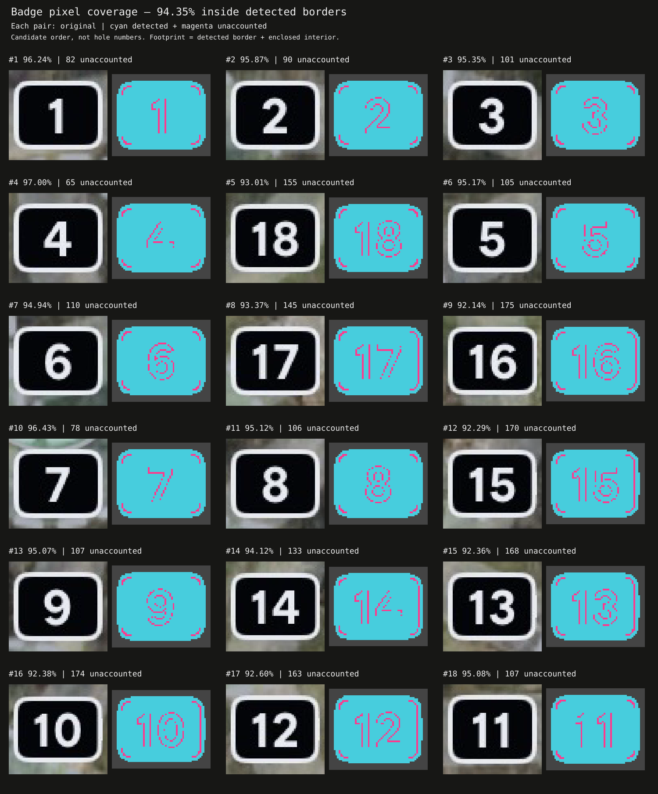

# Investigate S1 badge pixel coverage

Base checkpoint: 56076112878edf4ac167d97c66f9f83082abe2b1.
Implementation continues on lab/s0-viewer. Investigation belongs on this branch.
Do not merge or modify the implementation branch as part of this investigation.

## Observed
Dash's Track yields 18 badge candidates, containing 37,295 unique pixels.
Footprint = each detected white border plus its enclosed interior:
39,529 pixels, with 2,234 unaccounted (94.34845% coverage).
Individual candidates range 92.14189–97.00185%.
This is coverage of a detector-derived footprint, not annotated recall.
The bounding boxes total 41,244 pixels (90.42527% coverage); they include background corners.

Each pair is original / cyan detected plus magenta unaccounted.
Numbers label candidate order, not recognized hole IDs.
Missing pixels trace glyph edges and rounded inner corners.
Antialiasing is a hypothesis, not yet a classification.

## Reproduce
Build: npm run build --workspace @chainspot/alg
Run:
node scripts/run-stage.mjs packages/alg/dist/stages/S1/exp/badge-assembly experiments/dashs-track-edge-sensing/restored/edge-diagnostic/edge-reading-inspection/DashsTrack-full.jpg /tmp/s1-investigation

Read the final Calculation output in results.json: badgeCandidates.
For each candidate:
- Take border.part.pixels and border.bbox.
- Flood-fill exterior non-border pixels using four-neighbor connectivity, starting one pixel outside the bbox, within a one-pixel padded bbox.
- Footprint is the bbox pixels unreachable from that exterior, including border membership.
- UnaccountedPx = footprint minus candidate.pixels.
The original calculations use black max(R,G,B) <=45; white max(R,G,B) >=210 and OpenCV-compatible saturation <=45. Alpha ignored. Grouping is eight-connected and retains singletons.

## Investigation requested
1. Classify the unaccounted pixels using original RGB, proximity to Parts, and geometric location. Quantify rather than assuming all are antialiasing.
2. Inspect outer-edge pixels excluded by our footprint denominator. Determine what this measurement misses.
3. Assess whether a bounded refinement can recover pixel ownership while preserving plate/digit/border/loop associations.
4. If experimenting, use the executable PCR and registered Calculation overrides, retain Default for comparison, and render gained/lost/still-unaccounted pixels through JS.
5. Report findings, representative crops, exact arguments and tradeoffs for human review. Do not silently promote a refinement.

{BadgeFootprintDefinition}: whether outer antialiased pixels count as BadgePx, MutedPx, or remain outside.
{PixelOwnershipAtTransitions}: how mixed edge pixels should belong to adjacent Parts.

Existing validation: build and four focused tests passed; consolidated candidate pixel sets exactly matched the preceding reviewed assembly run. Browser controls were not verified. Full S1 digit recognition and final contract outputs are still pending; this investigation should not block them.
